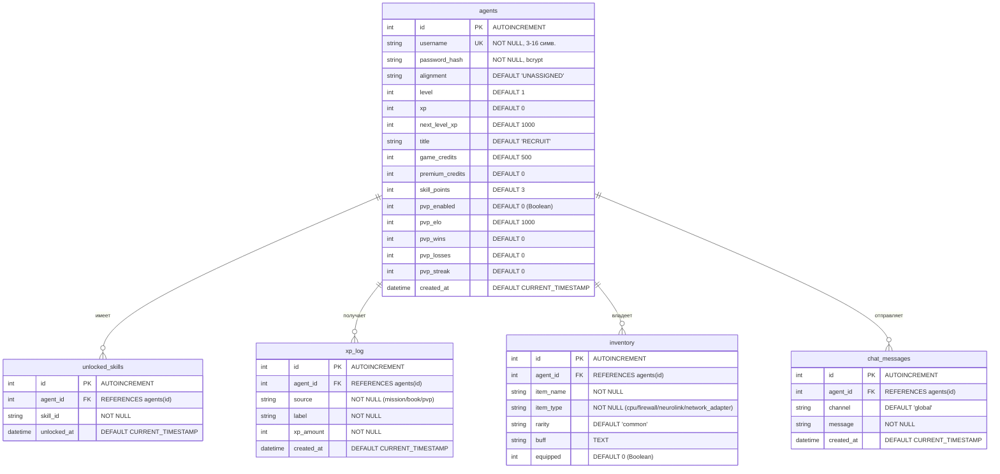
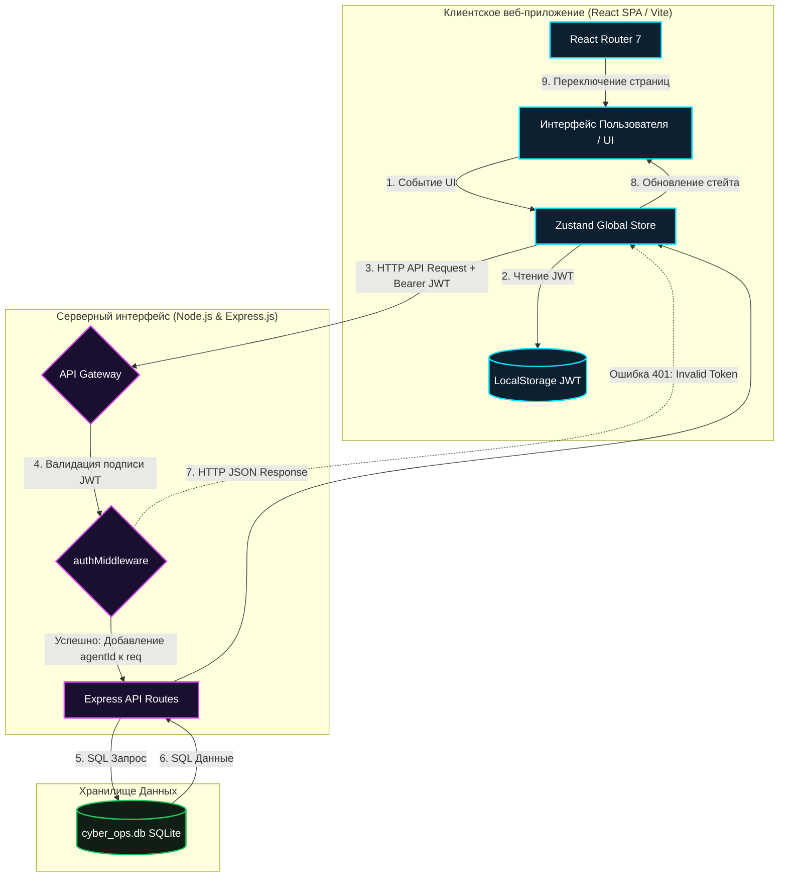
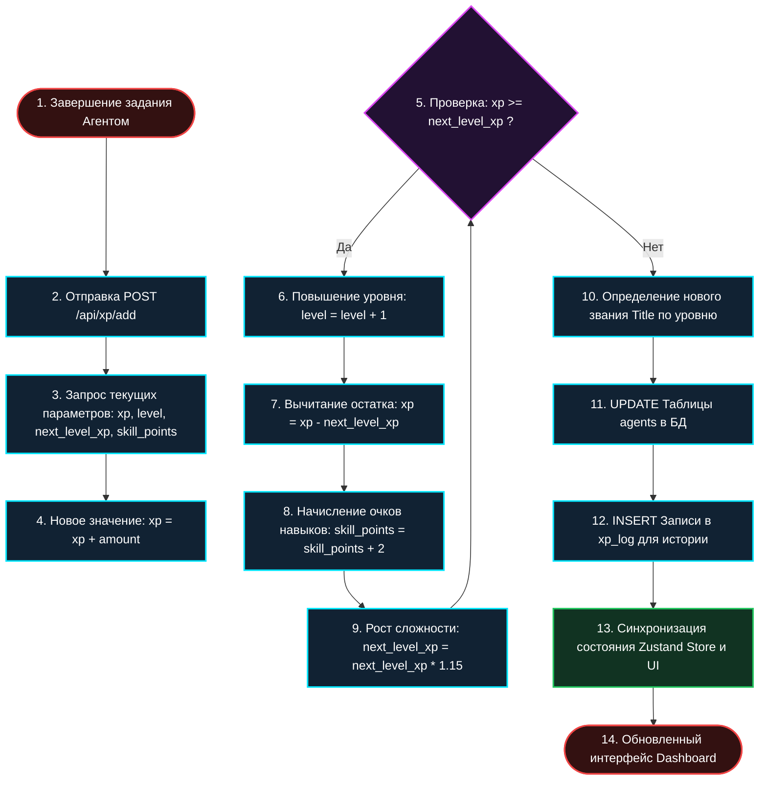

# ПРИЛОЖЕНИЕ Б. СТРУКТУРНЫЕ СХЕМЫ И ДИАГРАММЫ СИСТЕМЫ

В данном приложении приведены графические схемы архитектуры, логической структуры базы данных и основных алгоритмов функционирования игровой платформы **CYBER_OPS://CORE**. Диаграммы описаны на языке разметки схем **Mermaid.js**.

---

## Б.1. Логическая схема базы данных (Entity-Relationship Diagram)

Реляционная база данных системы функционирует под управлением СУБД SQLite. Архитектура базы состоит из центральной сущности `agents` (аккаунты пользователей) и связанных с ней дочерних таблиц по внешним ключам (Foreign Keys) с каскадными ограничениями целостности.

---

## Б.2. Схема архитектуры системы (Component & Communications Diagram)

Платформа представляет собой клиент-серверное одностраничное веб-приложение (SPA). Защита обмена данными реализована с помощью токенов доступа JWT (JSON Web Token), которые отправляются в HTTP-заголовках Authorization при каждом запросе к защищенным эндпоинтам.

---

## Б.3. Блок-схема игровых механик (Player Progression & XP Logic Flow)

Ниже представлена детальная блок-схема процесса начисления опыта (XP), прогрессивного масштабирования необходимого опыта для следующего уровня (+15% с каждым уровнем) и начисления очков навыков (+2 SP за каждый Level-up).

